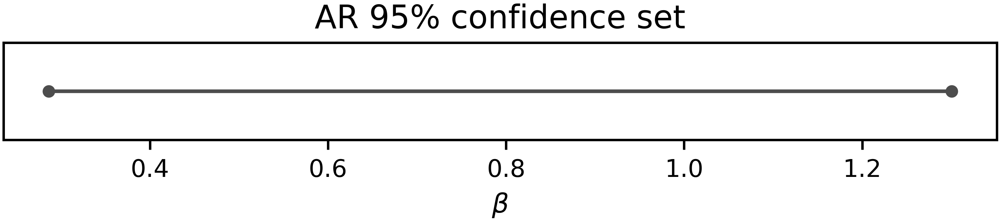
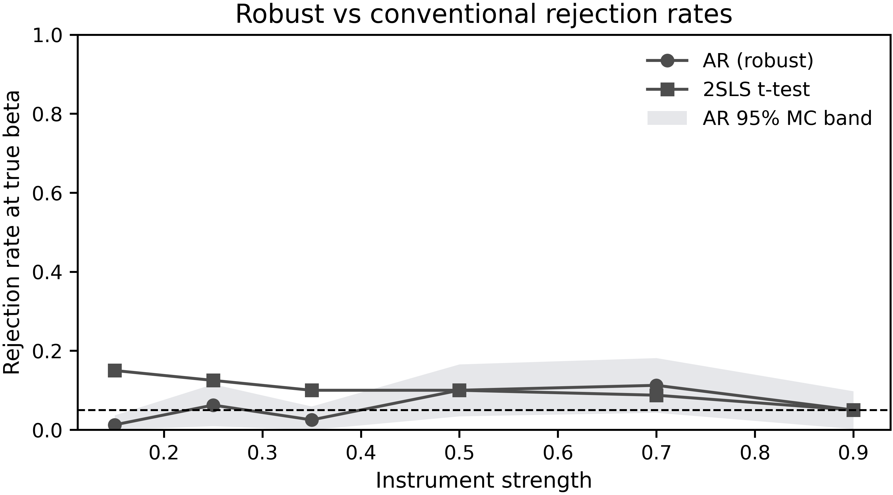
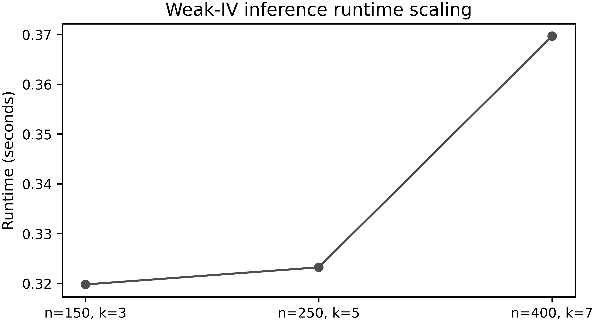

# Gallery

Publication-style figures generated directly from ivrobust. Each figure below
links to the notebook or script that produces it.

<figure class="iv-figure" markdown>

<figcaption>
AR confidence set with set-valued intervals. [PDF](assets/figures/ar_confidence_set.pdf)
 Source: [00_quickstart.ipynb](https://github.com/gsaco/ivrobust/blob/main/notebooks/00_quickstart.ipynb)
</figcaption>
</figure>

<figure class="iv-figure" markdown>

<figcaption>
AR, LM, and CLR p-values across the beta grid. [PDF](assets/figures/pvalue_curve.pdf)
 Source: [05_clr_in_practice.ipynb](https://github.com/gsaco/ivrobust/blob/main/notebooks/05_clr_in_practice.ipynb)
</figcaption>
</figure>

<figure class="iv-figure" markdown>

<figcaption>
Monte Carlo rejection rates across instrument strength (AR vs 2SLS t-test).
[PDF](assets/figures/rejection_vs_strength.pdf)
 Source: [03_simulation_study.ipynb](https://github.com/gsaco/ivrobust/blob/main/notebooks/03_simulation_study.ipynb)
</figcaption>
</figure>

<figure class="iv-figure" markdown>

<figcaption>
Runtime scaling for the unified weak-IV workflow. [PDF](assets/figures/runtime_scaling.pdf)
 Source: [08_runtime_scaling.ipynb](https://github.com/gsaco/ivrobust/blob/main/notebooks/08_runtime_scaling.ipynb)
</figcaption>
</figure>

All figures are reproducible via `python scripts/build_figures.py`.
