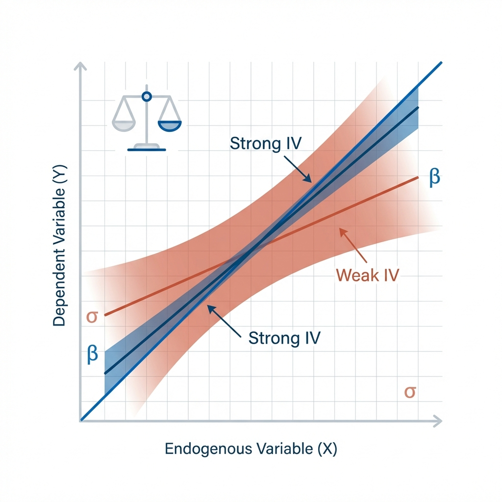

<div class="ivr-hero" markdown>

<span class="ivr-hero__badge">
<span class="emoji">🔬</span> Research-Grade Econometrics
</span>

<h1 class="ivr-hero__title">Weak-IV Robust Inference for Modern Econometrics</h1>

<p class="ivr-hero__subtitle">
A Python library implementing Anderson-Rubin, LM/K, and CLR tests with robust covariance options, 
set-valued confidence sets, and comprehensive diagnostics. Built by researchers, for researchers.
</p>

<div class="ivr-hero__actions">
<a href="quickstart/" class="md-button md-button--primary">Get Started</a>
<a href="reference/api/" class="md-button">API Reference</a>
<a href="https://github.com/gsaco/ivrobust" class="md-button">View on GitHub</a>
</div>

<div class="ivr-hero__features">
<div class="ivr-feature">
<div class="ivr-feature__icon">⚖️</div>
<div class="ivr-feature__text">
<strong>Weak-IV Robust</strong>
<span>Valid inference under weak identification</span>
</div>
</div>
<div class="ivr-feature">
<div class="ivr-feature__icon">📊</div>
<div class="ivr-feature__text">
<strong>Set-Valued CIs</strong>
<span>Disjoint and unbounded intervals supported</span>
</div>
</div>
<div class="ivr-feature">
<div class="ivr-feature__icon">🛡️</div>
<div class="ivr-feature__text">
<strong>Robust Covariance</strong>
<span>HC0-HC3, clustering, and HAC options</span>
</div>
</div>
</div>

</div>

<div class="ivr-badge-row">
<a href="https://github.com/gsaco/ivrobust/actions/workflows/ci.yml"></a>


</div>

---

<section class="ivr-section" markdown>

## The Weak Instrument Problem

<figure class="ivr-figure" markdown>

<figcaption>
<strong>Figure 1: The identification challenge.</strong> 
Strong instruments yield precise estimates (blue), while weak instruments create wide, unreliable confidence regions (coral). 
ivrobust provides tests that remain valid regardless of instrument strength.
</figcaption>
</figure>

<div class="ivr-callout ivr-callout--accent" markdown>
**Why this matters:** Standard IV inference (2SLS t-tests) can be severely distorted when instruments are weak. 
The Anderson-Rubin, LM, and CLR tests implemented in ivrobust maintain correct size even under weak identification,
following the guidance of [@andrews2019] and modern weak-IV econometrics.
</div>

</section>

---

<section class="ivr-section" markdown>

## Core Methods

<figure class="ivr-figure" markdown>

<figcaption>
<strong>Figure 2: ivrobust methodology.</strong> 
Three complementary approaches to weak-IV robust inference, each with distinct properties and use cases.
</figcaption>
</figure>

<div class="ivr-methods-grid" markdown>

<div class="ivr-method-card" markdown>
<div class="ivr-method-card__icon">⚖️</div>

### Anderson-Rubin (AR)

The foundational weak-IV robust test. Inverts the joint test on instruments 
for confidence sets that are valid regardless of instrument strength.

<div class="ivr-method-card__equation">
AR(β₀) = (Y - Xβ₀)'Pz(Y - Xβ₀) / s²
</div>

<span class="ivr-method-card__cite">📚 Anderson & Rubin (1949)</span>
</div>

<div class="ivr-method-card" markdown>
<div class="ivr-method-card__icon">📈</div>

### Lagrange Multiplier (LM/K)

Kleibergen's score-based test with optimal local power. Uses the score function 
under the null hypothesis for efficient weak-IV robust inference.

<div class="ivr-method-card__equation">
LM(β₀) = S(β₀)'Ω⁻¹S(β₀)
</div>

<span class="ivr-method-card__cite">📚 Kleibergen (2002)</span>
</div>

<div class="ivr-method-card" markdown>
<div class="ivr-method-card__icon">📊</div>

### Conditional Likelihood Ratio (CLR)

Moreira's conditional test combining AR and LM statistics. Achieves near-optimal 
power while maintaining weak-IV robustness through conditioning.

<div class="ivr-method-card__equation">
CLR(β₀) = ½(AR - rk + √((AR - rk)² + 4·LM·rk))
</div>

<span class="ivr-method-card__cite">📚 Moreira (2003)</span>
</div>

</div>

</section>

---

<section class="ivr-section" markdown>

## Quick Example

```python
import ivrobust as ivr

# Generate synthetic weak-IV data
data, beta_true = ivr.weak_iv_dgp(n=300, k=5, strength=0.4, beta=1.0, seed=0)

# Run weak-IV robust inference
res = ivr.weakiv_inference(
    data,
    beta0=beta_true,
    alpha=0.05,
    methods=("AR", "LM", "CLR"),
    cov_type="HC1",
)

# Access test results
print(f"AR p-value: {res.tests['AR'].pvalue:.4f}")
print(f"CLR confidence set: {res.confidence_sets['CLR'].intervals}")
```

<div class="ivr-button-row">
<a href="quickstart/" class="md-button md-button--primary">Full Quickstart Guide</a>
<a href="notebooks/" class="md-button">Interactive Notebooks</a>
</div>

</section>

---

<section class="ivr-section" markdown>

## Practitioner Workflow

<div class="ivr-workflow">
<div class="ivr-workflow__step">
<div class="ivr-workflow__icon">📁</div>
<h4>1. Prepare Data</h4>
<p>Structure your IV model with IVData</p>
</div>
<div class="ivr-workflow__step">
<div class="ivr-workflow__icon">🔍</div>
<h4>2. Diagnose</h4>
<p>Check instrument strength with diagnostics</p>
</div>
<div class="ivr-workflow__step">
<div class="ivr-workflow__icon">✓</div>
<h4>3. Test</h4>
<p>Run AR/LM/CLR tests at your hypothesis</p>
</div>
<div class="ivr-workflow__step">
<div class="ivr-workflow__icon">📈</div>
<h4>4. Report</h4>
<p>Generate publication-ready figures</p>
</div>
</div>

<a href="user-guide/workflow/" class="md-button">Complete Workflow Guide →</a>

</section>

---

<section class="ivr-section" markdown>

## Gallery Highlights

<div class="ivr-gallery" markdown>

<figure class="ivr-figure" markdown>

<figcaption>
<strong>P-value curves across the parameter space.</strong>
AR, LM, and CLR p-values showing where the null hypothesis is rejected.
</figcaption>
</figure>

<figure class="ivr-figure" markdown>

<figcaption>
<strong>Monte Carlo rejection rates.</strong>
AR maintains correct size while 2SLS t-test over-rejects under weak instruments.
</figcaption>
</figure>

</div>

<a href="gallery/" class="md-button">View Full Gallery →</a>

</section>

---

<section class="ivr-section ivr-team-section" markdown>

## Research Team

<p class="section-lead">
ivrobust is developed and maintained by researchers committed to rigorous, reproducible econometric software.
</p>

<div class="ivr-team-grid">
<div class="ivr-team-card">
<div class="ivr-team-card__avatar">GS</div>
<div class="ivr-team-card__info">
<h4>Gabriel Saco</h4>
<p>Lead Developer • Econometrics Research</p>
</div>
</div>
<div class="ivr-team-card">
<div class="ivr-team-card__avatar">+</div>
<div class="ivr-team-card__info">
<h4>Contributors</h4>
<p>Open source community</p>
</div>
</div>
</div>

</section>

---

<section class="ivr-section" markdown>

## Citing ivrobust

<div class="ivr-citation-block" markdown>
<span class="ivr-citation-block__label">📄 BibTeX</span>

```bibtex
@software{ivrobust,
  title = {ivrobust: Weak-IV Robust Inference in Python},
  author = {Saco, Gabriel and contributors},
  year = {2026},
  url = {https://github.com/gsaco/ivrobust},
  version = {0.2.0}
}
```

</div>

When using ivrobust, please also cite the methodological references for the specific 
tests you employ (see [References](references.md)).

</section>

---

<section class="ivr-section" markdown>

## Trust & Reproducibility

<div class="ivr-methods-grid" markdown>

<div class="ivr-method-card" markdown>
<div class="ivr-method-card__icon">🔄</div>

### Continuous Integration

All commits are tested against a comprehensive suite including linting, 
type checks, unit tests, notebook execution, and documentation builds.
</div>

<div class="ivr-method-card" markdown>
<div class="ivr-method-card__icon">🎯</div>

### Reproducible Figures

Every figure in the documentation is generated from committed code with 
fixed random seeds, ensuring full reproducibility.
</div>

<div class="ivr-method-card" markdown>
<div class="ivr-method-card__icon">📖</div>

### Clear Scope

Focused implementation of weak-IV robust inference for a single endogenous 
regressor with comprehensive documentation and examples.
</div>

</div>

</section>

---

<div class="ivr-button-row" style="justify-content: center; margin-top: 3rem;">
<a href="quickstart/" class="md-button md-button--primary">Get Started →</a>
<a href="user-guide/" class="md-button">User Guide</a>
<a href="reference/api/" class="md-button">API Reference</a>
</div>
