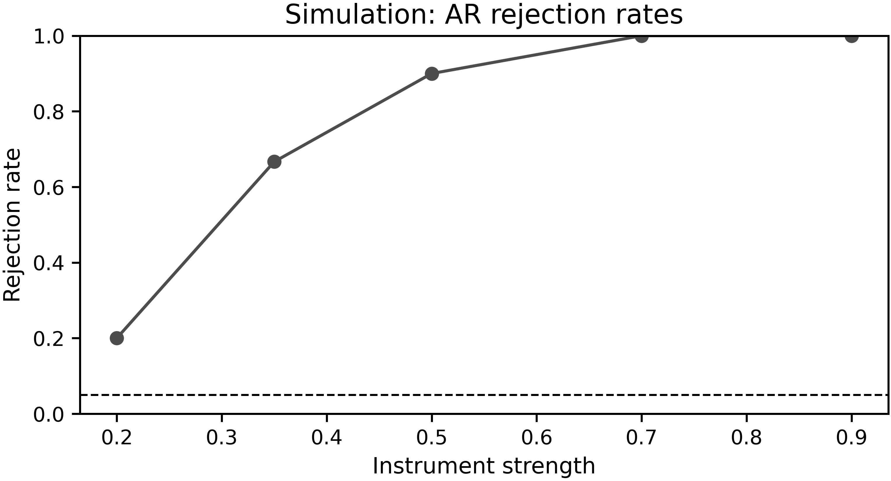

# Gallery

Publication-style figures generated directly from ivrobust. All assets are
reproducible via `python scripts/build_docs_assets.py`.

<figure class="iv-figure" markdown>

<figcaption>
AR confidence set with set-valued intervals. [PDF](assets/figures/ar_confidence_set.pdf)
</figcaption>
</figure>

<figure class="iv-figure" markdown>

<figcaption>
AR, LM, and CLR p-values across the beta grid. [PDF](assets/figures/pvalue_curve.pdf)
</figcaption>
</figure>

<figure class="iv-figure" markdown>

<figcaption>
Simple simulation of rejection rates across instrument strengths. [PDF](assets/figures/simulation_rejection.pdf)
</figcaption>
</figure>

